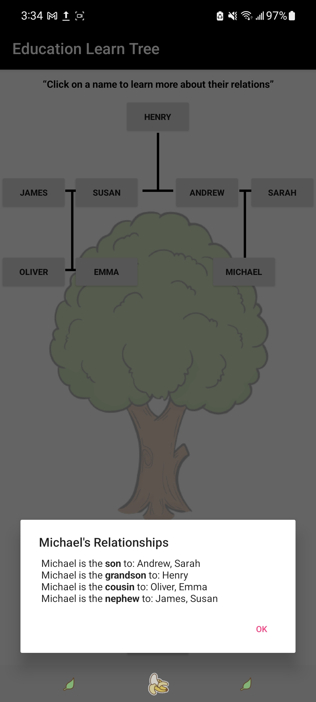
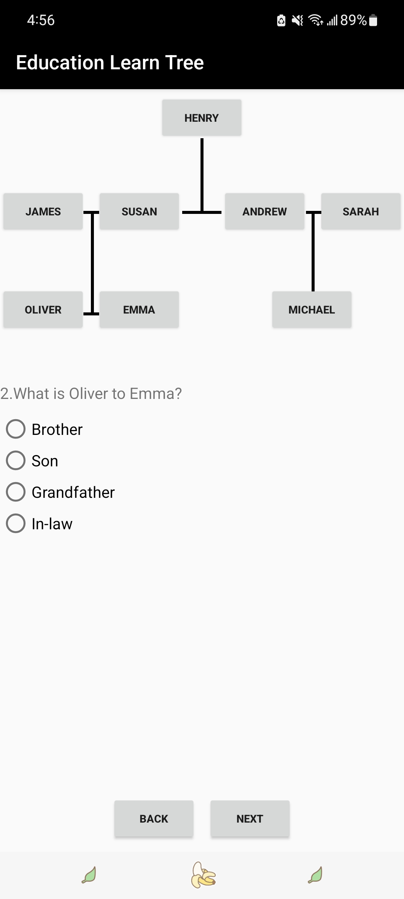

# Family-Relationships-Learning_app

This is a group project for Software Design for Visual Environments

* In this project, my teammate and I worked together to build an educational application called **Family Relationships Learning**

* Our goal is to provide children with a **visualized family tree** and **tests** to learn and memorize the family relationships easily and quickly

* I am responsible for **all the codes and UI designs** of this project, and my teammate is responsible for the presentation of the application

* [educationlearntree](java/com/example/educationlearntree) folder contains all my Java codes
* [res](res) folder contains the images and XML files for the UI of this application

* [layout](res/layout/) folder contains all the XML files designing all the layouts of the app

## Details and Demonstartion

* When the users are inside the `Learn` page, they can click on any buttons constituting the visualized family tree to learn more about the family relationships associated with that button. For example:

  

* When the users are inside the `Test` page, ten questions awaiting them to answer, each of which is inside a page

* **FLAG_ACTIVITY_REORDER_TO_FRONT** is used inside the `Test` page so that the application remembers the users' choices when they click on the `next` and `back` buttons at the bottom of the screen to answer different questions

> The application resets all the question pages once the users submit their answers

  

* When the users are inside the `submit` page after clicking on the `submit` button, they will see their final scores and which questions that they answered wrongly

> Users pass the test if they score more than (including) 60 points 

* Below is a demonstration of running the application on a real phone (Samsung A71)

https://user-images.githubusercontent.com/84282744/190730249-429a8010-7319-4c50-90a1-31921eafda6a.mp4

